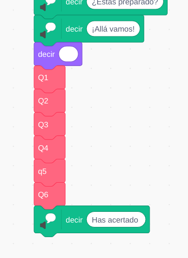
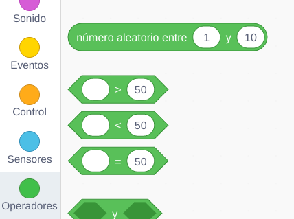
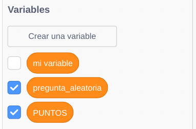
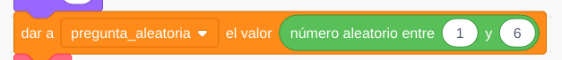
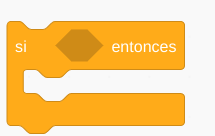
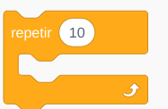

## Preguntas en orden aleatorio

Muchas veces queremos que nuestras preguntas se hagan en orden aleatorio, para evitar que el usuario se sepa las respuestas por orden.

Un ejemplo podía ser un programa como el siguiente:

En el que se ha creado un bloque por pregunta y las hacemos ordenados siempre de la misma manera.

En la paleta de **Operadores** (verde) podemos encontrar un bloque que nos permite generar un número aleatorio (al azar) entre los 2 límites que le indiquemos

En nuestro caso pondremos entre 1 y el número de preguntas que tenegamos.

Vamos a guardar este número elegido al azar en una variable porque lo necesitamos usar en varias ocasiones. 

Creamos nuestra variable y le damos ese valor aleatorio:

Ahora usaremos una sentencia condicional (en la paleta control) para mostrar la pregunta correspondiente al número que se ha elegido:

Hacemos que se repita todo el proceso para que se hagan la mayoría de las preguntas:

  

Pero con esto programa no podemos asegurar que se vayan a realizar **todas** las preguntas. Para conseguirlo tendríamos que hacer una programación más compleja, donde llevaramos la cuenta de las preguntas que se han hecho y las que no.